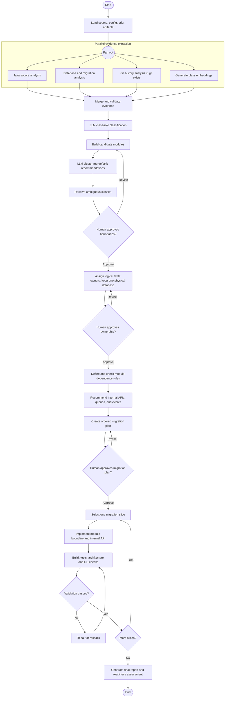

# LangGraph Architecture for Monolith Migration

## 1. Purpose

Use LangGraph as a stateful workflow orchestrator for analyzing a Spring Boot monolith, identifying candidate service boundaries, planning modular-monolith changes, and validating migration slices.

The graph is **workflow-first**, with specialist analysis and LLM nodes. Deterministic source/database analysis supplies evidence; LLM nodes interpret that evidence and make constrained recommendations; human approval gates control high-impact decisions.

The target architecture keeps one physical database initially while enforcing logical table ownership by module.

## 2. High-Level Workflow



## 3. Graph Components

### 3.1 Shared workflow state

Keep graph state compact. Pass artifact paths or artifact IDs rather than copying the full source graph into every node.

```text
MigrationState
├── run_id, source_revision, configuration
├── source_path, repository_path
├── artifacts
│   ├── inventory
│   ├── dependency_graph
│   ├── database_access
│   ├── embeddings
│   ├── candidate_modules
│   ├── merge_decisions
│   ├── ownership
│   ├── contracts
│   └── migration_plan
├── decisions
│   ├── pending_reviews
│   └── approved_decisions
├── migration_step
├── validation_results
├── warnings, errors
└── status
```

Use reducers or artifact-specific fields for parallel branches so agents do not overwrite one another's state.

### 3.2 Parallel evidence subgraph

Run independent analyzers concurrently:

- **Java source analyzer:** classes, references, method calls, annotations, entities, transactions
- **Database analyzer:** tables, readers, writers, migrations, foreign keys
- **Git analyzer:** co-commit evidence; run only when the configured repository contains `.git`
- **Embedding node:** semantic vectors generated from normalized class descriptions

A merge-and-validation node reconciles identifiers, schema versions, and evidence provenance before LLM interpretation begins.

### 3.3 Boundary synthesis subgraph

Keep these as separate, constrained nodes:

- Class-role classification
- Candidate module synthesis
- Cluster merge/split review
- Ambiguous class ownership resolution
- Shared/platform class identification

Each LLM node should receive evidence records and return schema-validated structured output containing:

- Decision
- Confidence
- Evidence IDs
- Rationale
- Review requirement
- Model and prompt version

LLMs recommend; they do not invent source facts or directly modify code.

### 3.4 Human approval nodes

Use LangGraph interrupts for approval of:

- Candidate module boundaries
- Logical database table ownership
- Migration sequence and risk
- High-risk or low-confidence recommendations

Persist graph state before interrupting so execution can resume after a decision without repeating prior analysis.

### 3.5 Migration subgraph

Migrate one module slice at a time:

1. Create or enforce the package/module boundary.
2. Restrict repository and entity access to the owning module.
3. Replace cross-module implementation calls with internal APIs.
4. Keep the existing physical database while enforcing logical table ownership.
5. Run build, tests, dependency checks, and database-access checks.
6. On failure, route to repair or rollback; on success, select the next slice.

Do not allow agents to edit the same files concurrently. Assign each implementation node a narrow, explicit file scope.

## 4. Persistence, Recovery, and Auditability

Configure a LangGraph checkpointer for durable checkpoints. This supports:

- Resuming after human approval
- Retrying failed analysis nodes
- Continuing migration steps after interruption
- Auditing state and decisions for each run

Store durable artifacts separately from graph state. The graph state should reference artifact locations and retain only the data needed for routing and decisions.

## 5. Failure Handling

- Retry transient source-analysis, model, or external-service failures with bounded retry policies.
- If Git history is unavailable because `.git` is absent, omit the Git signal rather than filling it with zero values.
- If an LLM response is invalid or low confidence, preserve deterministic results and route the decision to review.
- If validation fails after code changes, block progression until repair passes or the slice is rolled back.
- Record failed nodes, error summaries, and artifacts needed to reproduce the failure.

## 6. Recommended Design Choice

Use a workflow-first graph with specialist agent nodes rather than a free-form supervisor that delegates without fixed sequencing. Migration has ordering constraints:

```text
Evidence before interpretation
    -> Ownership before API changes
    -> Human approval before high-risk edits
    -> Validation after every migration slice
```

Explicit graph edges make these constraints visible, auditable, and resumable.

## 7. Outputs

Each completed run should produce machine-readable artifacts and a human-readable report, including:

- Source inventory
- Dependency graph and evidence
- Embeddings and model metadata
- Candidate modules
- Cluster merge/split recommendations
- Logical database ownership
- Dependency violations
- Internal API/event contracts
- Migration plan and rollback steps
- Validation outcomes
- Extraction-readiness assessment

The report must distinguish candidate boundaries, human-approved module boundaries, validated modules, and independently extracted microservices.
